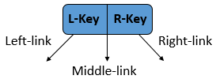

  故事写不好，跑来写技术分析的键盘钢琴师。  
  
  *“高度是上帝的诅咒。他就是嫉妒！”——《树经》*  
    
  *树，拥有不羁的外表，好争。查找，插入，删除是族群的天赋技能。*  
  
  *树群在漫长的码海中不断演化，诞生了一种优秀的血统，二叉树。  
  二叉树以其优良的结构，美妙的对称著称，并且增删查找的天赋更加突出，得以快速地壮大。  
  不久之后，有的二叉树不满足于自身单一的2-node结构，开始尝试改变规则。  
  第一个变革的二叉树小名叫三多，三多有一天坐在那沉思：“我叫三多，为什么我的结点都是连着两个，而不是三个呢？”  
  说干就干是三多的特点，于是，他从自身改造出了第一个3-node结构。  
  很快，他又往身上弄了更多3-node。   
  三多看着自己完全走样的身材，十分满意，还给自己起了个洋名字。*  

  *“从今天起，我叫 2-3 tree。”*  

  ****
  
  **2-3 tree**，自命不凡的二叉树变革者，以平衡为美。  
  树中同时存在2-node和3-node结构，并且叶子均在同一层，具体结构：  
  - 2-node : 有且仅有一个key， 两条Link，分别是left-link，和right-link。  
    - 2-node根据key排序方式与一般二叉树无异;  
     
   

  - 3-node : 有两个key,分别为L-Key, R-Key, 而L-Key < R-Key。  
   有三条Link，分别是Left-link, Middle-link, Right-link，  
    - Left-link所连接的左子树的Key 小于 L-Key，  
    - Middle-link连接的子树的Key 处于L-Key和R-Key之间，  
    - Right-link连接的右子树的Key 大于 R-Key；  
  
   

*经过不短的摸索，三多，现在叫2-3 tree，发现自己高度减少了，技能上多了个光环，于是迷迷糊糊就找上了树族长，得到一本《树经》，他便翻了起来。*  
  
2-3 tree随着普遍的高度减少，查找的效率相应地提高。  
对于插入的操作，因为结点的结构不再单一，便有不同的情况：    
1. 当插入到2-node时，这好办，2-node变3-node  
    
2. 但是对于3-node时却不能这么做了，因为3-node已经是单个结点的终极形态。于是，我们使用**分解**大法，从本不合理的4-node结构中提取出中部的Key，形成三个新的2-node。  
  
    

同时，问题也来了，如果该结点存在父亲结点，那该怎么办？  
那就是**向上合并**大法。  
- 若该父亲结点为2-node，上升的结点直接与该父亲结点合并成为一个3-node，插入过程结束。
    
- 若该父亲结点为3-node，那么新合并的结点还是一个不存在的4-node，这样问题并没有解决，怎么办呢？  
    

想法很简单，就是仍然分解该4-node，形成新的3个2-node，然后让中部的2-node持续向上合并，不断重复类似的步骤，直到遇到一个2-node的祖父结点为止。  
如果一直向上合并到树的根结点都遇到3-node的祖父结点，那么只要再将4-node的根结点分解，将新形成的中部2-node作为新的根，插入的操作到此也必然结束。  
    
我们来观察一下这棵树，会发现此时树的高度增加了1。  
是的，2-3 tree 的高度增长不是直觉上的从上往下，而是从底部往上增长的。  

接下来，我们分析一下删除操作。  
如果发生在内结点，我们可以想象，操作将会直接影响到结点的左右子树，为了维持平衡的特性，复杂度将相当高。那么，有没有办法减轻这样的困扰呢？  
我们先来看看传统的线性结构，当删除某个结点的时候，我们会考虑该结点的直接前驱和直接后继，分别称为immediate predecessor(简称IP), immediate successor(简称IS)。  
  
试想一个增量序列，不考虑其物理存储，删除某个元素的操作便是通过predecessor向后移动，或者successor向前移动的方式，覆盖了原来该结点的位置，实现删除。  
当然，对于线性结构来说，这样的删除方式太麻烦了，往往需要一大块的元素进行移动，
但是对于2-3 tree结构，我们发现，对于某个结点，它的直接前驱和直接后继，分别就是该结点的左子树的最大结点，以及右子树的最小结点。  
因为其平衡特性，该结点必然是位于叶子上的。  
所以我们只需要将直接前驱或者直接后继跟删除结点进行替换，那么删除的过程就会简化成删除叶子结点的过程了。(往往采用直接后继进行替换，减少方案)  
  
现在来比较删除叶子结点的不同情况。  
1. 最简单的情况，假设删除元素位于的叶子结点是一个3-node，我们只需直接删除其中的元素，使该结点变成了一个2-node。  
  
2. 若结点是一个2-node，那么我们删除了该元素，将会导致2-3 tree变得不平衡，所以我们就需要重新维持平衡。  
  - 假如该结点的父亲结点是一个2-node，但是兄弟结点是一个3-node，我们就使用**借点法**，我们可以这样理解，父亲结点和兄弟结点临时组成一个4-node，然后根据2-3 tree的性质，运用分解方法，使得该4-node分解成三个新的2-node，那么这就是最终的结果。表现为，父亲结点向下移动到被删结点的位置，从兄弟结点当中，根据其位于父亲结点的左右位置，分割成两个2-node，然后补充父亲结点的位置。 
    
  - 如果待删结点的父亲结点是一个3-node， 但是此时，兄弟结点中仍然存在3-node，那么仍然可以使用借结点的招数。
  方法就是，靠近被删结点的方向的第一个3-node，向父结点献出一个元素（被删元素在其左，献出左端元素，在其右，献出右端元素），父节点此时可看成暂时形成了一个4-node。此时，神奇的操作来了，父结点分解的方式并不是向上合并，而是对被删结点的方向，向下吐出一个结点，从而重新形成新的稳定状态。具体可看图。
    
    
    
  - 那么如果父亲结点仍然是3-node，但是兄弟结点都是2-node呢?这时候，父亲没有了三个儿子的分别支撑，自然也没办法再维持3-node的结构了，所以他就传功给靠近删除结点的兄弟，使得该兄弟成为新的3-node，保护世界的任务就交给你了。  
    
    
  - 但是，事情并不是我们想的这么简单，如果出现，父亲和兄弟都只是2-node，那该怎么办？  
  这时候，我们即没有办法向兄弟借，也不能用父亲传功。那父亲和兄弟结点为了自保，只好抱成一团，将被删除结点交给更高层次的祖父结点处理，再应用前面向兄弟借点和父亲传功的等方法进行处理。如果空结点一直上溯到根部，最终方法也很直接，当空根的子结点不为空，使之为新的根结点，树的高度减一，否则就是一棵空树。  
  
  
  综合来看，2-3 tree的树高度增加和减少，恰好是一个逆过程，从下往上增加，以及从上往下减少。  
  同时，我们明显感觉到了，插入和删除的情况众多，实现2-3 tree的代码复杂度相当高，这情况也包括下面将介绍的2-3-4 tree。

  *2-3 tree相当明显地减少了高度，天赋异禀，一跃成为树族群的明星人物，一大波树妖美女嚷嚷着要跟2-3 tree生猴子。  
  大群的2-3 tree后代在树群中繁衍了开来，实乃生命的大和谐啊。  
  2-3 tree的后人们继承了当年还叫三多的祖先那股精神气，不再满足于3-node，他们还要更多，如果增加到4-node呢？  
  有了这个设想，这一棵棵闲不住的树，日干夜干。  
  这不，4-node也出现了。*  
  
***

  **2-3-4 tree**， 进化的2-3 tree，一群为减少高度不断奋斗（丧心病狂）的2-3 tree们，结构特点：
  - 一如2-3 tree的2-node以及3-node
  - 4-node，可以容纳3个Key, 4个link。 
     
    

2-3-4 tree的插入和删除操作，类似于2-3 tree。  
当元素插入到4-node，我们先将该4-node分解成三个2-node结构，按照2-3 tree时所描述的方法向上合并，然后再进行插入该元素到合适位置。  
为使插入操作更清晰，一种**top-down approach**，在查找插入位置时，从根结点开始，遇到4-node，便把它拆分，向上合并，直到插入的叶结点位置。

     //topdown approach的插入伪代码
     insert(Key key, Value value) {
         Node cur = root;
         while(cur.chooseChild(key) != NULL) {   
             //根据key,和当前node的结果返回合适的child  
             cur = cur.chooseChild(key);  
             if(cur.isFourNode()) {  
                cur.split(); //拆分成三个2-node的方法  
             }  
         }  
         if(cur.isTwoNode()) {  
            cur.makeThreeNode(key, value); //变成3-node  
         }else if(cur.isThreeNode()) {  
            cur.makeFourNode(key, value); //变成4-node  
         }  
     }  
  
  
该方法有两个保证：  
  - 插入的元素必然在叶子结点上，且插入的叶子结点只能是2-node，或者是3-node，而不是4-node  
  - 不存在连续的4-node  
  
对于2-3-4 tree的删除操作也是类似的过程，简化步骤，用IP或IS替代删除结点，让删除发生在叶子结点上，对于3-node，4-node的结点采用直接删除的方式。  
对于2-node，情况就变得更加多和更复杂，因此不花时间阐述。  

我们需要寻求办法使插入，删除操作变得清晰，简单。因此，树结构再一次进化。  
  
**请看下集**  
